<h1 align="center">Hi there, I'm Drishya 👋</h1>

  <em>Data Science &amp; Software Engineering</em> 
  <em>B.Tech CSE @ MSIT · BS Data Science @ IIT Madras</em>

---

<h3><code>drishya22@github ~ $ whoami</code></h3>

  

<h3><code>drishya22@github ~ $ ./contributions.sh</code></h3>

---

### 🚀 What I'm Working On

- 🧠 ML/DL projects — evaluation, preprocessing, model iteration
- 📊 Statistical modeling — regression, ANOVA for applied problems
- 🧩 Full-stack builds with FastAPI + Vue.js
- 📝 GATE DA 2027 preparation

---

## 🌐 Socials
   

## 💻 Tech Stack
             

