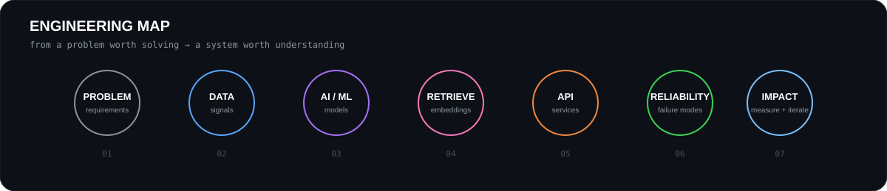

<div align="center">



<br />

<a href="https://linkedin.com/in/drishyag22/"></a>
<a href="https://github.com/drishya22"></a>
<a href="https://leetcode.com/u/drishya22/"></a>
<a href="https://www.kaggle.com/drishya23f3001900"></a>
<a href="https://huggingface.co/drishya23f3001900"></a>
<a href="https://medium.com/@drishyagarg22"></a>

<br /><br />

### Building intelligent software at the intersection of **AI, backend engineering & data**.

**Problem → Architecture → Implementation → Evaluation → Deployment**

</div>

---

## `drishya22@github:~$ whoami`

<div align="center">

</div>

> **I build systems, then learn why they work.**
>
> I am interested in the engineering behind AI products — not only the model, but the APIs, data flow, retrieval, evaluation, reliability and trade-offs around it.

---

## ⚡ Signal, not noise

<div align="center">

| 🎓 EDUCATION | 🧠 PROBLEM SOLVING | ☁️ AI | 🧑‍🏫 TEACHING |
|:---:|:---:|:---:|:---:|
| **9.45** MSIT CGPA | **675+** LeetCode | **AWS AI & ML Scholars** | **IIT Madras Mentor** |
| B.Tech CSE + BS Data Science | DSA / CP | Nanodegree phase | Mathematics for Data Science |

</div>

---

## 🧭 The engineering direction

<div align="center">

</div>

My work has gradually moved from coursework and application development toward **AI-powered software systems**: machine learning, deep learning, multimodal retrieval, LLM applications, APIs and backend architecture.

---

## 🚀 Selected work

<table>
<tr>
<td width="50%" valign="top">

### 💳 Payment Recovery Intelligence
**AI decisioning + backend systems**

A payment-failure intelligence workflow built around a safety boundary: **AI recommends; deterministic policy decides what is allowed.**

`Python` `FastAPI` `ML` `LLM` `Decision Systems`

[View repository →](https://github.com/drishya22/payment-recovery-intelligence)

</td>
<td width="50%" valign="top">

### 🖼️ AI Photo Management
**Multimodal retrieval**

Semantic photo search, categorization, face grouping and duplicate detection using CLIP embeddings, vector search and computer vision.

`FastAPI` `CLIP` `ChromaDB` `Computer Vision`

[View repository →](https://github.com/drishya22/photo-management-platform)

</td>
</tr>
<tr>
<td width="50%" valign="top">

### 🤖 AI Web App Generator
**LLM + automation**

A backend workflow that turns natural-language requirements into generated web applications and automates repository/deployment workflows.

`FastAPI` `LLMs` `GitHub API` `Pydantic`

[View repository →](https://github.com/23f3001900/TDS-Project-1)

</td>
<td width="50%" valign="top">

### 🧠 Smart MCQ Solver
**Deep learning + evaluation**

A transformer-based ranking system exploring TF-IDF, BiLSTM+Attention, DistilBERT and DeBERTa with MAP@3 evaluation.

`PyTorch` `Transformers` `DeBERTa` `NLP`

[View repository →](https://github.com/23f3001900/dl-genai-project-26-t2)

</td>
</tr>
</table>

<div align="center">

**More projects, experiments and coursework →** [explore all repositories](https://github.com/drishya22?tab=repositories)

</div>

---

## 🛠️ Engineering stack

<div align="center">


<br /><br />


</div>

---

## 🧪 How I like to build

```text
                         ┌──────────────────┐
                         │      PROBLEM      │
                         └────────┬─────────┘
                                  │
                         requirements first
                                  ▼
                    ┌──────────────────────────┐
                    │        ARCHITECTURE       │
                    │ components · boundaries  │
                    │ trade-offs · failure     │
                    └────────────┬─────────────┘
                                 │
                                 ▼
                    ┌──────────────────────────┐
                    │      IMPLEMENTATION       │
                    │ APIs · data · models     │
                    │ workers · validation     │
                    └────────────┬─────────────┘
                                 │
                                 ▼
                    ┌──────────────────────────┐
                    │        EVALUATION        │
                    │ metrics · tests · logs   │
                    │ does it actually improve?│
                    └────────────┬─────────────┘
                                 │
                                 ▼
                         ┌──────────────┐
                         │   ITERATE    │
                         └──────┬───────┘
                                │
                                └──────────→ back to the problem
```

The questions I increasingly care about are **retrieval quality, model evaluation, API design, asynchronous work, reliability, cost, observability, failure modes and system trade-offs.**

---

## 📈 Contribution field

<div align="center">

</div>

> **A real contribution graph is more meaningful than manufactured streak commits.**
> This profile no longer uses a daily cron job to create activity; the graph is meant to reflect actual work.

---

## 🎓 Beyond the code

- **B.Tech Computer Science Engineering** — Maharaja Surajmal Institute of Technology · **9.45 CGPA**
- **BS Data Science & Applications** — IIT Madras
- **Course Mentor** — IIT Madras, Mathematics for Data Science
- **Software Engineering Fellow (AI)** — HeadStarter AI
- **AWS AI & ML Scholars** — selected for the Nanodegree phase
- **675+ LeetCode problems** across data structures and algorithms

---

## 🔭 Currently exploring

```text
┌─────────────────────────────────────────────────────────────────────┐
│                                                                     │
│  ████████████████████  AI PORTFOLIO                                │
│  ███████████████       RAG / SMART MCQ                             │
│  ███████████           BACKEND SYSTEM DESIGN                       │
│  ████████              CANDIDATE SCREENING                         │
│  ██████                INDEPENDENT STARTUP / RESEARCH              │
│                                                                     │
│  next: learn → build → break → understand → rebuild                │
│                                                                     │
└─────────────────────────────────────────────────────────────────────┘
```

---

## 🌐 Find me around the internet

<div align="center">

[](https://linkedin.com/in/drishyag22/)
[](https://github.com/drishya22)
[](https://leetcode.com/u/drishya22/)
[](https://www.kaggle.com/drishya23f3001900)
[](https://huggingface.co/drishya23f3001900)
[](https://medium.com/@drishyagarg22)

</div>

<br />

<div align="center">

```text
$ ./keep_learning
> build()
> debug()
> understand()
> repeat()
```

**Still learning. Still building. Still becoming better.**

</div>
