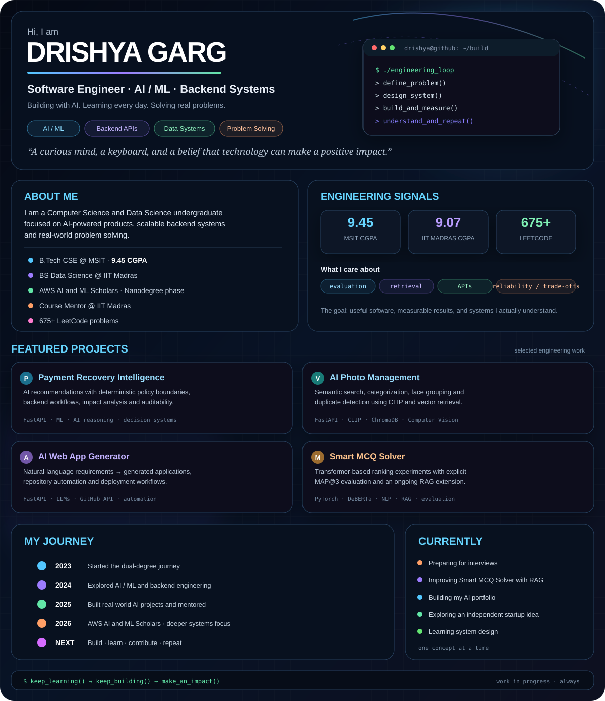

<div align="center">



<br />

<a href="https://linkedin.com/in/drishyag22/"></a>
<a href="https://github.com/drishya22"></a>
<a href="https://leetcode.com/u/drishya22/"></a>
<a href="https://www.kaggle.com/drishya23f3001900"></a>
<a href="https://huggingface.co/drishya23f3001900"></a>
<a href="https://medium.com/@drishyagarg22"></a>

</div>

---

## `drishya22@github:~$ whoami`

I am a Computer Science and Data Science undergraduate interested in the engineering behind AI products — not only the model, but the **APIs, data flow, retrieval, evaluation, reliability and trade-offs** around it.

My current direction is:

```text
Problem
   ↓
Requirements
   ↓
Architecture
   ↓
Implementation
   ↓
Evaluation
   ↓
Deployment
   ↓
Learn → iterate → rebuild
```

> **I build systems, then learn why they work.**

---

## 🚀 Selected work

<table>
<tr>
<td width="50%" valign="top">

### 💳 Payment Recovery Intelligence

AI-driven payment-failure intelligence with a deliberate safety boundary:

**AI recommends → deterministic policy decides → bounded execution → verification → audit**

[Repository →](https://github.com/drishya22/payment-recovery-intelligence)

`FastAPI` `ML` `LLM reasoning` `Decision systems`

</td>
<td width="50%" valign="top">

### 🖼️ AI Photo Management

Multimodal photo intelligence with semantic search, categorization, face grouping and duplicate detection.

[Repository →](https://github.com/drishya22/photo-management-platform)

`FastAPI` `CLIP` `ChromaDB` `Computer Vision`

</td>
</tr>

<tr>
<td width="50%" valign="top">

### 🤖 AI Web App Generator

Turns natural-language requirements into generated web applications and automates repository and deployment workflows.

[Repository →](https://github.com/23f3001900/TDS-Project-1)

`FastAPI` `LLMs` `GitHub API` `Automation`

</td>
<td width="50%" valign="top">

### 🧠 Smart MCQ Solver

Transformer-based ranking experiments with explicit MAP@3 evaluation. Currently being extended into a RAG experiment.

[Repository →](https://github.com/23f3001900/dl-genai-project-26-t2)

`PyTorch` `DeBERTa` `NLP` `RAG`

</td>
</tr>
</table>

<div align="center">

**[Explore all repositories →](https://github.com/drishya22?tab=repositories)**

</div>

---

## 🧩 Engineering interests

| Area | What I am building / learning |
|---|---|
| **AI / ML** | Transformers, NLP, multimodal systems, embeddings, model evaluation |
| **GenAI** | LLM applications, RAG, grounded generation, retrieval evaluation |
| **Backend** | FastAPI, REST APIs, SQLAlchemy, service boundaries, validation |
| **Data** | PostgreSQL, SQLite, vector search, data pipelines |
| **Systems** | Reliability, caching, asynchronous work, failure modes, trade-offs |
| **Developer tooling** | GitHub APIs, Docker, Linux, CI/CD and automation |

---

## 🛠️ Stack

<div align="center">


<br /><br />


</div>

---

## 🧠 How I like to build

```text
┌─────────────────────────────────────────────────────────────────┐
│                         PROBLEM                                 │
│                   What actually matters?                        │
└──────────────────────────────┬──────────────────────────────────┘
                               ↓
┌─────────────────────────────────────────────────────────────────┐
│                       ARCHITECTURE                              │
│             boundaries · data flow · trade-offs                 │
└──────────────────────────────┬──────────────────────────────────┘
                               ↓
┌─────────────────────────────────────────────────────────────────┐
│                      IMPLEMENTATION                             │
│              APIs · models · workers · storage                  │
└──────────────────────────────┬──────────────────────────────────┘
                               ↓
┌─────────────────────────────────────────────────────────────────┐
│                        EVALUATION                               │
│               metrics · tests · logs · failure                  │
└──────────────────────────────┬──────────────────────────────────┘
                               ↓
                         ITERATE + LEARN
```

The questions I increasingly care about are **Does it work? Why does it work? What happens when it fails? What does it cost? What trade-off did I make?**

---

## 🎓 Beyond the code

- **B.Tech Computer Science Engineering** — Maharaja Surajmal Institute of Technology · **9.45 CGPA**
- **BS Data Science and Applications** — IIT Madras
- **Course Mentor** — IIT Madras, Mathematics for Data Science
- **Software Engineering Fellow (AI)** — HeadStarter AI
- **AWS AI and ML Scholars** — selected for the Nanodegree phase
- **675+ LeetCode problems** across data structures and algorithms

---

## 🔭 Currently exploring

```text
AI PORTFOLIO                  ████████████████████
SMART MCQ + RAG              ███████████████
BACKEND SYSTEM DESIGN        ███████████
CANDIDATE SCREENING          ████████
INDEPENDENT STARTUP /        ██████
RESEARCH

next:
learn → build → break → understand → rebuild
```

---

## 🌐 Find me

<div align="center">

[LinkedIn](https://linkedin.com/in/drishyag22/) ·
[GitHub](https://github.com/drishya22) ·
[LeetCode](https://leetcode.com/u/drishya22/) ·
[Kaggle](https://www.kaggle.com/drishya23f3001900) ·
[Hugging Face](https://huggingface.co/drishya23f3001900) ·
[Medium](https://medium.com/@drishyagarg22)

<br /><br />

```text
$ keep_learning()
> keep_building()
> make_an_impact()
> repeat()

Still learning. Still building. Still becoming better.
```

</div>
